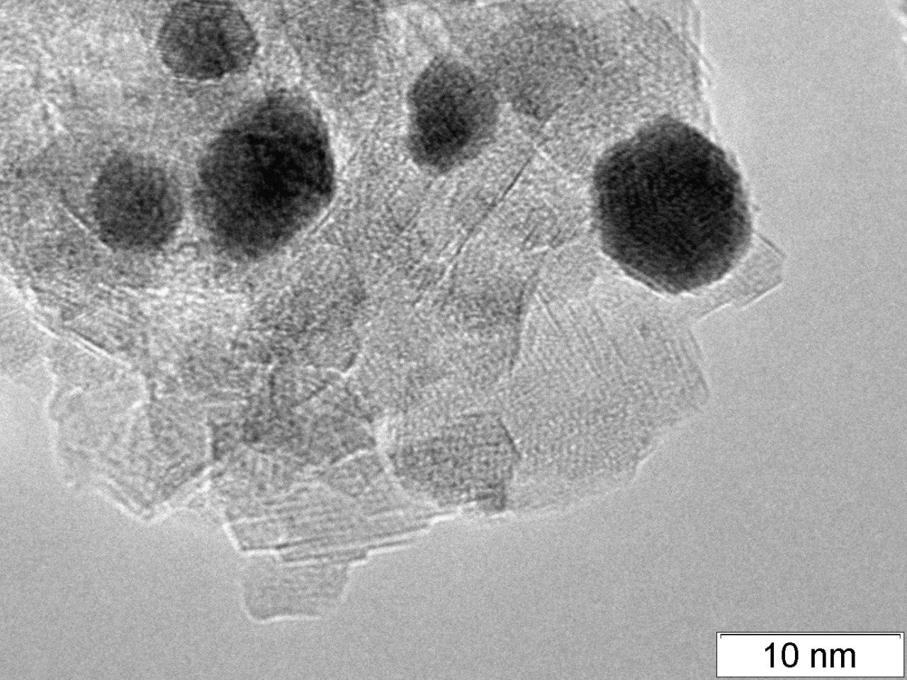

  

## Transmission electron microscopy (TEM) images of metal nanoparticles deposited on the surface of porous carriers. 
These samples are used as heterogeneous catalysts. The aim of the study is to determine the average particle size. The average particle size is required to calculate the specific catalytic activity per active site of the catalyst. This characteristic is the main measure of the catalytic activity of systems and is used both in the preparation of catalysts, their operation and deactivation, as well as in the study of the mechanisms of catalytic reactions.
To determine the average particle size, the researcher usually measures several hundred particles by hand. Based on statistics, histograms of the particle size distribution are built, the average value is calculated, and the distribution width is determined. The accuracy of determining the average size strongly affects the reliability and reproducibility of the patterns found in experiments.

## Usage
The dataset is split into two folders - for training and validating the neural network respectively. Existing classes are "face" and "bottom". The idea is to indicate if the particle is covered by another one. Of course, you can determine the size of the particle as well if you want to. For ease of use, segmentation masks are stored in COCO data format. The exact format of the annotations is described on the COCO website http://cocodataset.org/.
